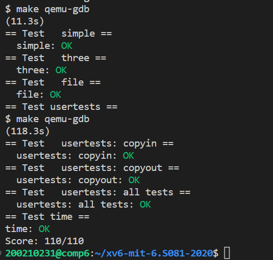

# Lab: Copy-on-Write Fork for xv6
https://pdos.csail.mit.edu/6.828/2020/labs/cow.html

虚拟内存提供了一定程度的间接性：内核可以通过将PTE标记为无效或只读来拦截内存引用，从而导致页面错误，并且可以通过修改PTE来更改地址的含义。在计算机系统中有一种说法，任何系统问题都可以通过间接解决。懒惰分配实验提供了一个例子。本实验室探索了另一个例子：写时复制。

难度：⭐⭐⭐(可能经过页表和懒分配的锤炼，觉得这个不是很难)

## Task: Implement copy-on-write

### 0.基本思路

cow和lazy alloc都是利用trap（异常）来提升操作系统内存管理性能的trick。两者的思路都是当进程需要空间时，我们并不直接给他，而是给他一个“承诺”，当他发现这是一切都是假的，找上门的时候，我们才兑现承诺（雾。。）   
这两个问题分为3部分：  
1. 给出“承诺”但不兑现
2. 处理因为承诺没兑现，造成的用户异常（用户中断处理）  
3. 处理因为承诺没兑现，造成的内核异常

### 1.基础工作
因为现在同一物理页由多个进程共享，为了防止一个进程释放时将这个共享物理页也给释放了，我们需要用一个ref，记录每个物理页当前由多少个进程共享。
1. 当此页被分配时，ref设为1
2. 当此页因为fork被添加进子程序页表的映射时，ref++
3. 当此页被回收时，ref--，若ref=0，才可以真正回收

这里使用一个数组来存ref，同时给他配一个锁。数组长度就是KERNELBASE到PHYSTOP的总页数
```c
struct {
  struct spinlock lock;
  int ref[(PHYSTOP - KERNBASE) / PGSIZE];
} phys_page_ref;
```
在初始化的时候，ref全部设为1.freerange()是通过kfree()来将空页加进链表的，ref要先减1，变成0之后才加进链表。此函数在kinit时调用
```C
//init ref array
void
ppgrefinit()
{
  initlock(&phys_page_ref.lock, "physical page ref");
  int cnt = sizeof(phys_page_ref.ref) / sizeof(int);
  for(int i=0; i < cnt; i++)
    phys_page_ref.ref[i] = 1;
}
```
increment，decrement和获取ref的操作
```C
//ref count increment
void
refinc(uint64 pa)
{
  if(((uint64)pa % PGSIZE) != 0 || (char*)pa < end || (uint64)pa >= PHYSTOP)
    panic("refinc");

  acquire(&phys_page_ref.lock);
  phys_page_ref.ref[PA2IDX(pa)] += 1;
  release(&phys_page_ref.lock);
}

//ref count decrement
void
refdec(uint64 pa)
{
  if(((uint64)pa % PGSIZE) != 0 || (char*)pa < end || (uint64)pa >= PHYSTOP)
    panic("refinc");

  acquire(&phys_page_ref.lock);
  phys_page_ref.ref[PA2IDX(pa)] -= 1;
  release(&phys_page_ref.lock);
}

//get ref count number
int
getref(uint64 pa)
{
  return phys_page_ref.ref[PA2IDX(pa)];
}
```
这里定义了一个宏PA2IDX用于计算物理地址对应的数组索引
```C
#define PA2IDX(pa)((((uint64)pa) & 0xFFFFFFF) >> 12)  //physical address to ref array index
```
回收物理页时kfree(),先自减，在判断是否为0，若为0再释放
```C
  refdec((uint64)pa);
  if(getref((uint64)pa) != 0)
    return;
  //if ref == 0, release this page
```
分配物理页时kalloc(),ref设为1
```C
  if(r){
    memset((char*)r, 5, PGSIZE); // fill with junk
    refinc((uint64)r);
  }
  return (void*)r;
```
### 2.给出”承诺“
fork()会调用uvmcopy()来为子进程复制。   
修改uvmcopy(),不为子进程分配新物理页。父子进程共享物理页，同时将父子页表的pte的flags改为只读，同时添加一个新的标志位COW表示是写时复制。这里需要注意将物理页的ref++
```C
// Given a parent process's page table, copy
// its memory into a child's page table.
// Copies both the page table and the
// physical memory.
// returns 0 on success, -1 on failure.
// frees any allocated pages on failure.
int
uvmcopy(pagetable_t old, pagetable_t new, uint64 sz)
{
  pte_t *pte;
  uint64 pa, i;
  uint flags;
  // char *mem;

  for(i = 0; i < sz; i += PGSIZE){
    if((pte = walk(old, i, 0)) == 0)
      panic("uvmcopy: pte should exist");
    if((*pte & PTE_V) == 0)
      panic("uvmcopy: page not present");
    pa = PTE2PA(*pte);
    flags = (PTE_FLAGS(*pte) & ~PTE_W) | PTE_COW;
    *pte = (*pte & ~PTE_W) | PTE_COW; //change parent's flags
    // if((mem = kalloc()) == 0)
    //   goto err;
    // memmove(mem, (char*)pa, PGSIZE);
    if(mappages(new, i, PGSIZE, pa, flags) != 0){ //share physical page
      // kfree(mem);
      goto err;
    }
    refinc(pa);
  }
  return 0;

 err:
  uvmunmap(new, 0, i / PGSIZE, 1);
  return -1;
}
```
### 3. 处理因为承诺没兑现，造成的用户异常（用户中断处理）  
中断时判断产生异常的原因，若为15就可能是因为COW造成的异常。若是其他异常，或cow异常没解决才会杀死进程。
```C
else {
    int is_cow_done = 0;

    if(r_scause() == 15){
      //write page fault
      uint64 va = r_stval();
  
      if(copy_on_write(va, p->pagetable) < 0){
        goto except;
      }
      is_cow_done = 1;
    }

    except:
    if(is_cow_done == 0){
      printf("usertrap(): unexpected scause %p pid=%d\n", r_scause(), p->pid);
      printf("            sepc=%p stval=%p\n", r_sepc(), r_stval());
      p->killed = 1;
    }
  }
```
这里也是将cow handler封装成一个函数,其中包含合法性判断和最终为其分配物理页，原来的物理页记得kfree掉（kfree会自己检测是否真的要释放它）
```C
//copy on write handler
int
copy_on_write(uint64 va, pagetable_t pagetable)
{
  pte_t *pte;
  uint flags;

  // va cannot bigger than MAXVA
  if(va >= MAXVA)
    return -1;

  // va must have mapping in pagetable
  if((pte = walk(pagetable, va, 0)) == 0)
    return -1;

  // means no need to handle
  if((*pte & PTE_W))
    return 0;
  
  // only handle page fault cause by COW
  if((*pte & PTE_COW) == 0)
    return -1;
  
  //copy on write
  uint64 pa = PTE2PA(*pte);
  flags = (PTE_FLAGS(*pte) | PTE_W) & ~PTE_COW; //process can write now
  char *mem;
  if((mem = kalloc()) == 0)
    return -1;
  memmove(mem, (char*)pa, PGSIZE);  // copy
  *pte = PA2PTE(mem) | flags; //reset pte
  kfree((void *)pa);
  return 0;
}
```

### 4. 处理因为承诺没兑现，造成的内核异常
因为COW，内核可能在copyout的时候，va对应的空间不能写，产生内核异常。使用封装好的函数就行。函数里边会判断是否可写，若不可写就分配+复制+更新映射
```c
// Copy from kernel to user.
// Copy len bytes from src to virtual address dstva in a given page table.
// Return 0 on success, -1 on error.
int
copyout(pagetable_t pagetable, uint64 dstva, char *src, uint64 len)
{
  uint64 n, va0, pa0;
  // pte_t *pte;

  while(len > 0){
    va0 = PGROUNDDOWN(dstva);
    if(copy_on_write(va0, pagetable) < 0)
      return -1;
    pa0 = walkaddr(pagetable, va0);
    if(pa0 == 0)
      return -1;
    n = PGSIZE - (dstva - va0);
    if(n > len)
      n = len;
    memmove((void *)(pa0 + (dstva - va0)), src, n);

    len -= n;
    src += n;
    dstva = va0 + PGSIZE;
  }
  return 0;
}
```

这样就做完啦！xv6内存管理三部曲完成！

## Test



## 收获
1. 异常时是返回-1，还是panic要弄清楚
2. 程序流程要弄清楚，每一步之间的相关性（比如修改copyout，要先检查va0是否可写，不可以的话就cow，之后在复制）
