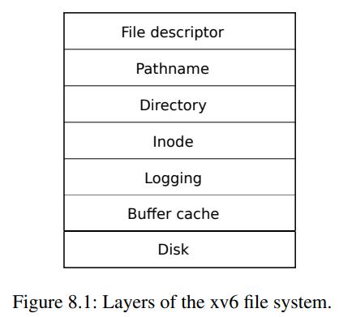
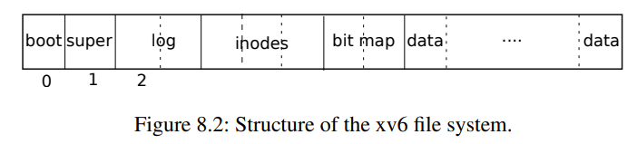
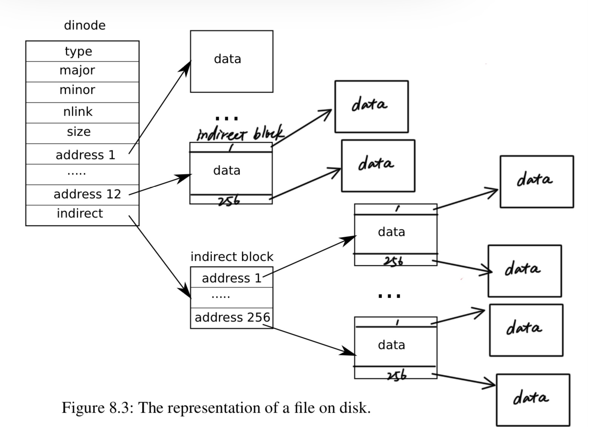

# Lab: file system
https://pdos.csail.mit.edu/6.828/2020/labs/fs.html

在这个实验中你将向xv6文件系统添加“大文件”和“符号链接”。

难度：⭐⭐⭐⭐   
（本次实验代码少，并不算难。难在xv6文件系统逐级抽象，需要理解源码）
## Preliminaries
xv6的文件系统分为6层，通过逐层抽象实现文件管理。
   

硬盘的最小操作单位为大小1024B的块。硬盘分布如下：

## Task 1：Large files
此任务基于``inode``层，和类似于之前做的页表，实现如图所示的二级索引（就有点类似二级页表，但我觉得比页表简单）     

+ 首先，修改对应的宏定义（如NDIRECT）   
+ 然后，修改`bmap()`,模仿一级索引的写法实现二级索引。这里需要注意当修改buffer block后要调用`log_write()`, 当不使用buffer block后要调用`brelse()`
```C
static uint
bmap(struct inode *ip, uint bn)
{
...
  // doubly-indirect block
  bn -= NINDIRECT;
  if(bn < NINDIRECT_DOUBLE){
    if((addr = ip->addrs[NDIRECT+1]) == 0)
      ip->addrs[NDIRECT+1] = addr = balloc(ip->dev);
    bp = bread(ip->dev, addr);
    a = (uint*)bp->data;

    bni = (uint)(bn / NINDIRECT);
    if((addr = a[bni]) == 0){
      a[bni] = addr = balloc(ip->dev);
      log_write(bp);
    }
    brelse(bp);

    bp2 = bread(ip->dev, addr);
    a = (uint*)bp2->data;
    if((addr = a[bn % NINDIRECT]) == 0){
      a[bn % NINDIRECT] = addr = balloc(ip->dev);
      log_write(bp2);
    }
    brelse(bp2);
    return addr;
  }
...
}
```
+ 最后，修改`itrunc()`添加二级索引遍历和删除。这里将释放数据block和索引block封装成一个递归函数`_itrunc(ip, addr, level)`，此函数会释放以addr为根的索引树（这颗树的节点都是block），但不会释放根指向的block（需要在此函数外删除）
```C
void
_itrunc(struct inode *ip, uint addr, int level)
{// not delete root
    int j;
    struct buf *bp;
    uint *a;

    bp = bread(ip->dev, addr);
    a = (uint*)bp->data;
    for(j = 0; j < NINDIRECT; j++){
      if(a[j]){
        if(level != 1)
          _itrunc(ip, a[j], level-1);
        bfree(ip->dev, a[j]);
      }
    }
    brelse(bp);
    // bfree(ip->dev, addr);  //not delete root
}
```
那么释放一级/二级索引是直接调用此递归函数即可。
```C
// Truncate inode (discard contents).
// Caller must hold ip->lock.
void
itrunc(struct inode *ip)
{
    ...
  if(ip->addrs[NDIRECT]){
    _itrunc(ip, ip->addrs[NDIRECT], 1);
    bfree(ip->dev, ip->addrs[NDIRECT]);
    ip->addrs[NDIRECT] = 0;
  }

  if(ip->addrs[NDIRECT+1]){
    _itrunc(ip, ip->addrs[NDIRECT+1], 2);
    bfree(ip->dev, ip->addrs[NDIRECT+1]);
    ip->addrs[NDIRECT+1] = 0;
  }
    ...
}
```
## Task 2：Symbolic links
此任务是综合使用文件系统，实现软链接。（主要是在于文件管理有关的系统调用，但涉及来自xv6不同抽象层的接口）   

Unix的文件系统中由硬链接（hard link）和符号链接（软链接 soft link）     
+ 硬链接只两个path指向同一个inode，即硬链接为inode有创建了一个“指针”。同时硬链接不能跨分区链接。
+ 软链接在path下创建一个T_SYMLINK类型的文件（即一个新的inode），然后在这个inode中保存target的pathname。可以跨越不同分区、不同机器、不同网络对文件进行链接。

具体实现：  
+ 首先，完成symlink系统调用的设置（如usys.pl）。增加新文件类别`T_SYMLINK`，新操作符`O_NOFOLLOW`
+ 然后，创建T_SYMLINK的文件，使用`create()`创建一个inode，使用`writei()`向inode里写入targetpath
```C
// symbolic link
uint64
sys_symlink(void)
{
  char target[MAXPATH], path[MAXPATH];
  struct inode *ip;


  if(argstr(0, target, MAXPATH) < 0 || argstr(1, path, MAXPATH) < 0)
    return -1;

  begin_op();
  if((ip = create(path, T_SYMLINK, 0, 0)) == 0){
    end_op();
    return -1;
  }

  if(writei(ip, 0, (uint64)target, 0, sizeof(target)) < sizeof(target)){
    iunlockput(ip);
    end_op();
    return -1;
  }

  iupdate(ip);
  iunlockput(ip);
  end_op();
  return 0;

}
```
+ 在`sys_open`中增加对软链接文件的处理。当`O_NOFOLLOW`为1表示打开文件本身而不打开链接的target文件。使用`readi()`读出inode里存储的targetpath，调用`namei()`会的targetpath指向的inode。若target文件也是一个软链接文件，就需要循环打开。这里使用`while`实现，同时判断循环次数，防止陷入死循环。
``` C
if(ip->type == T_SYMLINK){
    if((omode & O_NOFOLLOW) == 0){
      int sym_cnt = 0;
      char target[MAXPATH];
      struct inode *ip2;
      while(ip->type == T_SYMLINK){
        sym_cnt++;
        if(sym_cnt == 10){
          iunlockput(ip);
          end_op();
          return -1;
        }

        if(readi(ip, 0, (uint64)target, 0, sizeof(target)) < 0){
          iunlockput(ip);
          end_op();
          return -1;
        }

        iunlockput(ip);
        if((ip2 = namei(target)) == 0){
          end_op();
          return -1;
        }

        ip = ip2;
        ilock(ip);
      }
    }
  }
```

这样，本次实验就全部完成
## Test
`make grade`(bigfile测试超时限制设为600s， usertests测试超时限制设为600s)

**注意**：make grade实际上是调用`grade-lab-fs.py`脚本，其中设置了时间限制。（上面修改的时限原本为180s和360s）。不知道为什么我的large file实现效率很低（xv6指导书说任务一bigfile一般会在120s完成，而我的却要400s），首次影响`usertests`中的`writebig`用例也会超时严重。   

为保证结果正确性，我也在xv6中分别调用`bigfile`， `symlink` ，`usertests`。在没有时间限制下测试，都成功通过。

同时，我将`itrunc()`从递归调用`_itrunc()`改为双重循环，也超时严重。 
## 收获
1. task-1的bmap和itrunc类似之前做过的页表，分配和回收思路要清楚。
尤其是涉及recursive的时候。
2. 改完每一个地方都要记得保存，task2新增symlink系统调用时syscall.c没保存，测试失败。最后排查了很久。
3. 上面的任务都涉及接口的使用，只有理解源代码才能正确使用。
4. 注意锁机制在文件系统中的作用。