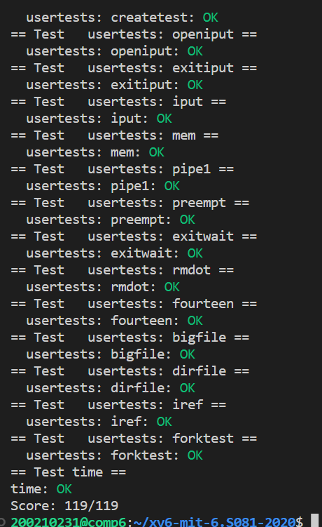

# Lab: lazy 
https://pdos.csail.mit.edu/6.828/2020/labs/lazy.html

<br>

O/S可以使用页表硬件玩的许多妙招之一是懒惰地分配用户空间堆内存。Xv6应用程序使用sbrk（）系统调用向内核请求堆内存。在我们提供的内核中，sbrk（）分配物理内存并将其映射到进程的虚拟地址空间。内核为大型请求分配和映射内存可能需要很长时间。例如，考虑一个千兆字节由2621444096字节的页面组成；这是一个巨大的分配数量，即使每一个都很便宜。此外，一些程序分配的内存比实际使用的内存多（例如，实现稀疏阵列），或者在使用之前分配内存。为了让sbrk（）在这些情况下更快地完成，复杂的内核会缓慢地分配用户内存。也就是说，sbrk（）不分配物理内存，只是记住分配了哪些用户地址，并在用户页表中将这些地址标记为无效。当进程第一次尝试使用任何给定的延迟分配内存页面时，CPU会生成一个页面错误，内核通过分配物理内存、将其归零并映射来处理该错误。

难度：⭐⭐⭐⭐

## Task 1: Eliminate allocation from sbrk()
简化sbrk(),根本上是简化grow_proc(n)。   
n>0,不调用uvmalloc() 
```C
// Grow or shrink user memory by n bytes.
// Return 0 on success, -1 on failure.
int
growproc(int n)
{
  uint sz;
  struct proc *p = myproc();

  sz = p->sz;
  if(n > 0){
    // if((sz = uvmalloc(p->pagetable, sz, sz + n)) == 0) {
    //   return -1;
    // }
    p->sz = sz + n;
    return 0;
  } else if(n < 0){
    sz = uvmdealloc(p->pagetable, sz, sz + n);
  }
  p->sz = sz;
  return 0;
}
```
n<0, 为了避免uvmdealloc()回收哪些还没分配而进程却觉得自己获得的内存，需要对uvmalloc(),也就是uvmunmap()进行改造，即当遇到有页面没有映射时直接忽略（未使用lazy alloc时，每个页面都是有物理页框对应的）
```C
// Remove npages of mappings starting from va. va must be
// page-aligned. The mappings must exist.
// Optionally free the physical memory.
void
uvmunmap(pagetable_t pagetable, uint64 va, uint64 npages, int do_free)
{
  uint64 a;
  pte_t *pte;

  if((va % PGSIZE) != 0)
    panic("uvmunmap: not aligned");

  for(a = va; a < va + npages*PGSIZE; a += PGSIZE){
    if((pte = walk(pagetable, a, 0)) == 0)
      // panic("uvmunmap: walk");
      continue;
    if((*pte & PTE_V) == 0)
      // panic("uvmunmap: not mapped");
      continue;
    if(PTE_FLAGS(*pte) == PTE_V)
      panic("uvmunmap: not a leaf");
    if(do_free){
      uint64 pa = PTE2PA(*pte);
      kfree((void*)pa);
    }
    *pte = 0;
  }
}
```
## Task 2: Lazy allocation
在usertrap()处理异常处，添加对缺页异常的处理
1. 根据scause寄存器的值，判断是否为缺页异常
2. 从stval寄存器中获得出现缺页的虚拟地址
3. 仿造uvmalloc(), 用kalloc()和mappages()来分配内存和建立映射

若因为lazy alloc造成的缺页异常被成功处理后，就不再打印异常信息和杀死进程了。
```C
...
else {
    // int is_lazy_alloc = 0;
    int is_lazy_alloc_handled = 0;

    if(r_scause() == 13 || r_scause() == 15){
      //page fault
      uint64 va = r_stval();
      if(va >= p->sz || va < p->trapframe->sp)
        goto done;
      
      //page fault caused by lazy allocation
      // is_lazy_alloc = 1;
      char *mem;
      if((mem = kalloc()) == 0){
        goto done; //out-of-memory
      }
      memset(mem, 0, PGSIZE);
      if(mappages(p->pagetable, PGROUNDDOWN(va), PGSIZE, (uint64)mem, PTE_W|PTE_X|PTE_R|PTE_U) != 0){
        kfree(mem);
        goto done; //mapping fault
      }
      is_lazy_alloc_handled = 1;
    }

    done: 
    if(!is_lazy_alloc_handled){
      printf("usertrap(): unexpected scause %p pid=%d\n", r_scause(), p->pid);
      printf("            sepc=%p stval=%p\n", r_sepc(), r_stval());
      p->killed = 1;
    }
  }
  ...
```

## Task 3: Lazytests and Usertests
为通过测试，需要解决一下问题：
1. Handle negative sbrk() arguments.      
    处理内存空间的回收,此问题已在Task 1解决
2. Kill a process if it page-faults on a virtual memory address higher than any allocated with sbrk().      
    如果造成缺页异常的虚拟地址大于已分配的地址要直接杀死进程。在缺页异常处理的时候添加判断语句即可。
    ```C
        if(va >= p->sz || va < p->trapframe->sp)
        goto done;
    ```
3. Handle the parent-to-child memory copy in fork() correctly.      
    让fork时父子进程内容正常复制。即修改其中的uvmcopy()函数，思路也是遇到没有映射对应的（即懒分配还没分配的）就忽略
    ```C
        if((pte = walk(old, i, 0)) == 0)
        // panic("uvmcopy: pte should exist");
        continue; //omit the unallocated one
        if((*pte & PTE_V) == 0)
        // panic("uvmcopy: page not present");
        continue; //omit the unallocated one
    ```
4. (本实验难度最大的地方)Handle the case in which a process passes a valid address from sbrk() to a system call such as read or write, but the memory for that address has not yet been allocated.     
    在内核中涉及来自用户的有效的虚拟地址时，因为是懒分配，这个虚拟地址可能在内核中还没分配对应的物理空间，若直接使用可能会触发内核异常。所以需要判断，当没有对应的物理空间时，就需要为其分配。    

    涉及来自用户的有效的虚拟地址的函数有read(), write()甚至是如fstat()等(这些函数都是涉及入参有指针)，因为用户和内核的页表不同所以要用copyin(), copyout(), copyinstr()     

    上面三个copy函数都根据用户的虚拟地址调用walkaddr()寻找物理地址。两个选择：1.在walkaddr()外进行判断和分配，这样要写三次 2.在walkaddr()中进行，只用写一次。   

    选择第二个。
    ```C
    pte = walk(pagetable, va, 0);
    if(!pte || !(*pte & PTE_V)){
        if(lazyalloc(va) == -1){
            return 0;
        }
    }
     ```
    当此虚拟地址没有映射（即没物理地址对应）的时候，对其懒分配。   
    这里将Task 2中缺页异常处理封装为函数lazyalloc()
    ```C
    //when page fault caused by lazy alloc, alloc a physical page then set mapping
    //return 0 on not physical space and mapping, but we set it
    //return -1 on error
    int
    lazyalloc(uint64 u_va)
    {
    // pte_t *pte;
    struct proc *p = myproc();

    if(u_va >= p->sz || u_va < p->trapframe->sp){
        return -1;
    }

    char *mem;
    if((mem = kalloc()) == 0){
        return -1;
    }
    memset(mem, 0, PGSIZE);
    if(mappages(p->pagetable, PGROUNDDOWN(u_va), PGSIZE, (uint64)mem, PTE_W|PTE_X|PTE_R|PTE_U) != 0){
        kfree(mem);
        return -1;
    }
    return 0;
    }
    ```
5. Handle out-of-memory correctly: if kalloc() fails in the page fault handler, kill the current process.   
    无法分配物理页时杀死进程，即上面对mem是否等于0的if判断
6. Handle faults on the invalid page below the user stack.   
    
    sbrk()分配的是堆的空间，那么因为懒分配缺页异常的虚拟地址应该是在p->trapframe->sp（栈顶）到p->sz之间  
    ```C
        if(u_va >= p->sz || u_va < p->trapframe->sp){
        return -1;
        }
    ```

## Outcome
