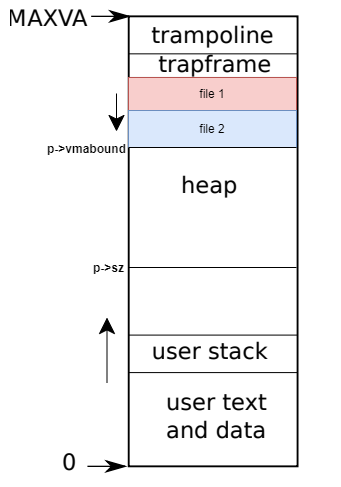
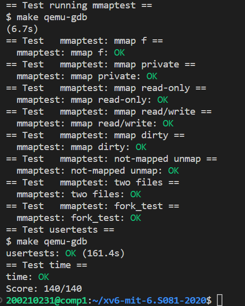

# Lab: mmap
https://pdos.csail.mit.edu/6.S081/2020/labs/mmap.html

mmap 和 munmap 系统调用允许 UNIX 程序对其地址空间进行详细控制。它们可用于在进程之间共享内存，将文件映射到进程地址空间，以及作为用户级页面错误方案的一部分，例如讲座中讨论的垃圾收集算法。在本实验中，您将向 xv6 添加 mmap 和 munmap，重点关注**内存映射文件**。

难度：⭐⭐⭐⭐⭐   
(本实验同时涉及文件系统和内存管理相关知识，有一定难度）

## Task 1：mmap
本次实验要求实现将**文件**映射到用户内存，实现建立映射和解除映射的系统调用。
### step 1：记录映射

为了记录每个进程都映射了哪些文件，这些映射在用户内存空间中的范围大小，映射的权限等信息，我们需要设计一个结构来存储这些信息。这里设计一个结构体vma用于记录（即VMA控制块），每个进程拥有一个长度为16的vma结构体数组用于存储这些控制块。`vmabound`用于记录所有映射区的下边界。
``` C
struct vma {
  int valid;                   // is mapped
  uint64 addr;                 // start virtual addr
  int length;               // virtual range length
  int prot;                   // permission
  int flags;                  // shared or not
  int fd;                      // mapped file
  int offset;                  // offset in file
  struct file *fp;          // mapped file
};

// Per-process state
struct proc {
    ···
  struct vma vma[16];              // mmap 
  uint64 vmabound;
    ···
};
```
### step 2：实现mmap
+ 首先需要在用户地址空间中，为文件映射选择映射的区域。这里选择原属于堆的空间，从trapframe向下增长（而堆是向上增长的）。其实这里因为xv6中堆栈不是对向增长的，我们的映射空间就在传统内存布局的栈的位置。如下图所示：     

          

这里并未考虑当munmmap造成的碎片问题。比如若file1解除映射后，file3再加入映射时，还是从vmabound向下分配，所以file1处会留下碎片。

+ 然后，寻找一个空闲的VMA控制块将信息填入。（同时这里使用懒分配策略，并不在此时为内存分配物理空间来写入文件内容，这样以提高效率），同时记住将对应文件的引用+1。

```C
uint64
sys_mmap(void)
{
  uint64 addr;
  int length, prot, flags, fd, offset;
  struct proc *p = myproc();
  struct vma *v;
  struct file *f;

  if(argaddr(0, &addr) < 0 ||
     argint(1, &length) < 0 ||
     argint(2, &prot) < 0 ||
     argint(3, &flags) < 0 ||
     argint(4, &fd) < 0 ||
     argint(5, &offset) < 0)
    return -1;

  if(addr != 0 || offset != 0)
    return -1;

  f = p->ofile[fd];
  if((prot & PROT_READ) && !f->readable)
    return -1;
  if((prot & PROT_WRITE) && (flags & MAP_SHARED) && !f->writable)
    return -1;
  
  if((PGROUNDDOWN(p->vmabound - length)) < PGROUNDUP(p->sz))
    return -1;
  //寻找空间
  addr = (PGROUNDDOWN(p->vmabound - length));
  p->vmabound = addr;
  //寻找空闲vma
  for(int i=0; i<16; i++){
    if(p->vma[i].valid == 0){
      v = &(p->vma[i]);
      goto find;
    }
  }
  
  return -1;
find://填入信息
  v->valid = 1;
  v->addr = addr;
  v->fd = fd;
  v->length = length;
  v->fp = f;
  v->offset = offset;
  v->flags = (flags == MAP_SHARED)? 1 : 0;
  v->prot = (((prot & PROT_READ)? PTE_R : 0) | ((prot & PROT_WRITE)? PTE_W : 0) | ((prot & PROT_EXEC)? PTE_X : 0));
  filedup(f);

  return addr;

}
```
### step 3：缺页处理
由于建立映射时使用的是懒分配策略。当进程尝试读取映射文件的内容时就会造成缺页异常。我们需要在此时为进程分配物理页，从文件读出内容到物理页，将缺页地址映射到物理页。
```C
int
mmap_lazyalloc(uint64 cause, uint64 stval){

  struct proc *p = myproc();
  struct vma *v;
  struct file *f;
  struct inode *ip;
  uint64 va_start;
  uint64 file_start;
  //寻找vma
  for(int i=0; i<16; i++){
    if(p->vma[i].valid){
      v = &(p->vma[i]);
      if(stval >= v->addr && stval < v->addr + v->length){
        goto find;
      }
    }
  }
  
  return -1;
find:
  if(cause == 13 && !(v->prot & PTE_R)) return -1;
  if(cause == 15 && !(v->prot & PTE_W)) return -1;

  va_start = PGROUNDDOWN(stval);
  file_start = va_start - v->addr;
  f = v->fp;
  ip = f->ip;

  char *pa;//分配物理页
  if((pa = kalloc()) == 0){
    return -1;
  }

  memset(pa, 0, PGSIZE);

  ilock(ip);//写入文件内容
  readi(ip, 0, (uint64)pa, file_start, PGSIZE);
  iunlock(ip);

  //建立映射
  if(mappages(p->pagetable, va_start, PGSIZE, (uint64)pa, (v->prot | PTE_U)) != 0){
    kfree(pa);
    return -1;
  }

  return 0;

}
```
### step 3：实现munmap
这里需要根据addr，找到相应的VMA控制块，解除虚拟空间与物理页之间的映射。如果解除的是全部区域，我们需要将文件引用计数-1。如果标记了`MAP_SHARED`还需将修改写回文件（这里进行了简化，即全部写回，不只是考虑写回”脏页“）
同时这里也假设解除映射不会造成”空洞“，即不会让一个映射区域一分为二。
``` C
uint64
sys_munmap(void)
{
  uint64 addr;
  int length;
  struct proc *p = myproc();
  struct vma *v;


  if(argaddr(0, &addr) < 0 || argint(1, &length) < 0)
    return -1;
  //寻找对应VMA
  for(int i=0; i<16; i++){
    if(p->vma[i].valid){
      v = &(p->vma[i]);
      if(addr >= v->addr && addr < v->addr + v->length){
        goto find;
      }
    }
  }
  
  return -1;
find:
  if(addr + length > v->addr + v->length){
    length = v->addr + v->length - addr;
  }

  if(v->flags){//写回文件
    filewrite(v->fp, addr, length);
  }
  //解除映射，释放对应物理页
  uvmunmap_mmap(p->pagetable, addr, (PGROUNDDOWN(addr + length) - addr)/PGSIZE, 1);

  if(addr == v->addr && length == v->length){
    fileclose(v->fp);
    v->valid = 0;
  } //更新VMA信息
  else if(addr == v->addr && length < v->length){
    v->length = v->addr + v->length - PGROUNDDOWN(v->addr + length);
    v->addr = PGROUNDDOWN(v->addr + length);
  }

  return 0;
}
```
这里的`uvmunmap_mmap()`和`uvmunmap()`一样，但因为是懒分配，部分页并没有映射，此时我们就忽略（这里的处理和懒分配实验解除映射的处理一样）
### step 4： 修改exit()和fork()
+ 当进程exit时，需要解除所有的内存文件映射。
```C
// Exit the current process.  Does not return.
// An exited process remains in the zombie state
// until its parent calls wait().
void
exit(int status)
{
    ···
  for(int i=0; i<16; i++){
    struct vma *v = &(p->vma[i]);
    if(v->valid){
      uvmunmap_mmap(p->pagetable, v->addr, (PGROUNDUP(v->addr + v->length) - v->addr)/PGSIZE, 1);
      fileclose(v->fp);
    }
  }
    ···
}
```
+ 当fork时，要将父进程的文件映射信息复制给子进程。同样这里也进行了简化，不考虑父子共享文件的物理页（或想页表实验一样，共享叶子页表），只复制相关VMA信息，当子进程缺页时再处理。
```C
// Create a new process, copying the parent.
// Sets up child kernel stack to return as if from fork() system call.
int
fork(void)
{
···
  for(int i=0; i<16; i++){
    struct vma *nv, *v = &(p->vma[i]);
    if(v->valid){
      nv = &(np->vma[i]);
      nv->addr = v->addr;
      nv->fd = v->fd;
      nv->flags = v->flags;
      nv->fp = v->fp;
      nv->length = v->length;
      nv->offset = v->offset;
      nv->prot = v->prot;
      nv->valid = v->valid;
      filedup(nv->fp);
    }
  }

  np->vmabound = p->vmabound;
···
}
```
这样就全部完成啦。
## Test

## 收获
1. 使用mmap可以将文件映射到内存（准确来说是用户的虚拟内存空间），这样就不必调用与文件有关的接口，直接在内存中进行操作。
2. 本次实验mmap就是操作系统整合自身的功能，为用户提供更高效的“服务”的例子。本次实验涉及文件系统和内存管理的相关知识，涉及文件操作、懒分配、页表、用户空间等等。需要对操作系统整体有把握。
3. 本次mmap的实现其实做了部分理想化假设，比如假设munmap解除映射时不会在原有映射范围中“打洞”、`MAP_SHARED=1`时写回文件全部写回，而不区分”脏页“。
4. 虽然本次实验全部通过测试，但实际来讲实现得很简单，比如写回文件时直接调用`filewrite()`而没有专门设计函数（因为使用的是懒分配，并不是所有区域都有物理映射，这样直接写回文件其实会报错，但这里直接忽略了），所以鲁棒性和安全性仍有需要改进之处。
5. 我的实现在文件映射分配空间时使用最简单的方法。这里的为每个映射文件”分配空间“问题就类似内存管理中的”连续分配“问题。我们可以将空间区域链接成一个链表，采用first fit、best fit等策略进行分配。
6. 除了上面的第4点，第5点可以优化的地方，还可以优化fork(),让父子进程共享文件映射的物理页。