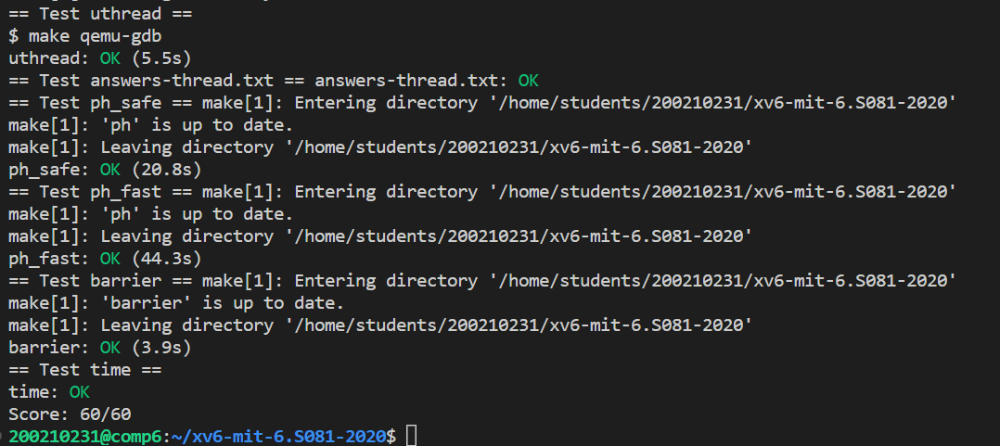

# Lab: Multithreading
https://pdos.csail.mit.edu/6.828/2020/labs/thread.html

本实验将使您熟悉多线程处理。您将在用户级线程包中实现线程之间的切换，使用多个线程来加速程序，并实现屏障。

难度：⭐⭐⭐   
(认真弄懂xv6 book chapter.7 和做过lock实验，这个实验就很简单了)
## Task 1: Uthread: switching between threads
此任务要求实现“用户级”线程调度。   
这个其实和内核中进程调度切换大同小异，只用照着进程切换的过程即可。    
首先，每个进程会有一个PCB来维护其运行时信息。对于线程，这里也有对应的线程控制块TCB。和PCB中拥有用于切换进程的struct context成员，这里我们也完全相同地为TCB增加这个成员。
```C
struct thread {
  char       stack[STACK_SIZE]; /* the thread's stack */
  int        state;             /* FREE, RUNNING, RUNNABLE */
  struct context context;       /* thread context*/
};
```
关于context：在进程/线程切换时我们只用保存/恢复 callee registers。caller registers将有编译时在调用函数前自动加上汇编指令。当然为了保证运行，不同进程/线程的ra和sp不同，也要保存在context中
```C
// Saved registers for user thread context switches.
struct context {
  uint64 ra;
  uint64 sp;

  // callee-saved
  uint64 s0;
  uint64 s1;
  uint64 s2;
  uint64 s3;
  uint64 s4;
  uint64 s5;
  uint64 s6;
  uint64 s7;
  uint64 s8;
  uint64 s9;
  uint64 s10;
  uint64 s11;
};
```
### thread_switch()
这个和内核中的swtch完全相同，就是一系列保存和恢复callee register。
note：a0和a1就是函数的两个入参。
```C
	.globl thread_switch
thread_switch:
	/* YOUR CODE HERE */
	sd ra, 0(a0)
    sd sp, 8(a0)
    sd s0, 16(a0)
    sd s1, 24(a0)
    sd s2, 32(a0)
    sd s3, 40(a0)
    sd s4, 48(a0)
    sd s5, 56(a0)
    sd s6, 64(a0)
    sd s7, 72(a0)
    sd s8, 80(a0)
    sd s9, 88(a0)
    sd s10, 96(a0)
    sd s11, 104(a0)

    ld ra, 0(a1)
    ld sp, 8(a1)
    ld s0, 16(a1)
    ld s1, 24(a1)
    ld s2, 32(a1)
    ld s3, 40(a1)
    ld s4, 48(a1)
    ld s5, 56(a1)
    ld s6, 64(a1)
    ld s7, 72(a1)
    ld s8, 80(a1)
    ld s9, 88(a1)
    ld s10, 96(a1)
    ld s11, 104(a1)
	ret    /* return to ra */
```
### uthread_create()
此函数的功能类似`allocproc()`,都是寻找空闲的PCB/TCB，填入相应的信息。这里我们就将t->context.ra设置为func（thread执行程序的入口），t->context.sp设置为这个线程自己的栈地址。注意到上面切换函数的最后一条指令ret，返回的是ra。那么当这个线程是第一次被切换到运行，就将从func的入口开始。
```C
  // YOUR CODE HERE
  //similar with allocproc()
  t->context.ra = (uint64)func; // func entry
  t->context.sp = (uint64)(t->stack + STACK_SIZE); //use thread's own stack
```
补充：`allocproc()`类似的代码：
```C
  // Set up new context to start executing at forkret,
  // which returns to user space.
  memset(&p->context, 0, sizeof(p->context));
  p->context.ra = (uint64)forkret;
  p->context.sp = p->kstack + PGSIZE;
```
### thread_schedule()
调度函数中找到下一线程，直接切换上下文即可
``` c   
    thread_switch((uint64)&t->context, (uint64)&current_thread->context);
```
## Task 2：Using threads 
此任务要求使用Unix的线程库（其中包含与锁有关的接口）来实现线程间同步，完成多线程对哈希表的读取。    
本实验中的hash表分为NBUCKET个子表，即有NBUCKET个哈希桶，每个桶是由entry连接而成的链表。
未加锁前程序错误是因为多个线程并发地访问“临界资源”entry链表，造成有的entry不能insert成功。详见`thread-answers.txt`    
做过lab lock,这个任务就很简单了。和lock实验一样，我们为每个哈希桶都加上一个互斥锁，来保证每个线程互斥访问。（甚至这个实验比memory buffer更简单）
```C
static 
void put(int key, int value)
{
  int i = key % NBUCKET;

  //acquire lock
  pthread_mutex_lock(&lock[i]);

  // is the key already present?
  struct entry *e = 0;
  for (e = table[i]; e != 0; e = e->next) {
    if (e->key == key)
      break;
  }
  if(e){
    // update the existing key.
    e->value = value;
  } else {
    // the new is new.
    insert(key, value, &table[i], table[i]);
  }

  //release lock
  pthread_mutex_unlock(&lock[i]);
}

static struct entry*
get(int key)
{
  int i = key % NBUCKET;

  //acquire lock
  pthread_mutex_lock(&lock[i]);
  struct entry *e = 0;
  for (e = table[i]; e != 0; e = e->next) {
    if (e->key == key) break;
  }
  //release lock
  pthread_mutex_unlock(&lock[i]);
  
  return e;
}
```

## Task 3: Barrier
此任务要求实现barrire机制，即先到达barrier的线程要等所有线程都到达barrire之后，所有线程才能进行下一步操作。    
这里的锁机制和xv6中sleep和wakeup基本相同。  
这里锁有两个cond和mutex，一个用于等待其他线程到达barrier，另保护一个bstate中的临界资源和保证不会lost wakeup。
``` c
pthread_cond_wait(&cond, &mutex);  // go to sleep on cond, releasing lock mutex, acquiring upon wake up
pthread_cond_broadcast(&cond);     // wake up every thread sleeping on cond
```
根据上面的两个函数，我们知道要broadcast，就要先获得mutex锁，这样才能避免lost wakeup。（我觉得这是这个是锁机制的”灵魂“）
```C
static void 
barrier()
{
  // YOUR CODE HERE
  //
  // Block until all threads have called barrier() and
  // then increment bstate.round.
  //
  pthread_mutex_lock(&bstate.barrier_mutex);
  bstate.nthread++;
  if(bstate.nthread < nthread){
    pthread_cond_wait(&bstate.barrier_cond, &bstate.barrier_mutex);
  }
  else{
    bstate.round++;
    bstate.nthread = 0;
    pthread_cond_broadcast(&bstate.barrier_cond);
  }
  pthread_mutex_unlock(&bstate.barrier_mutex);
  
}
```
这里使用bstate.nthread用来记录这一轮中已经到达barrire的线程数。如果还有线程没到达就wait，当最后一个线程到达，就broadcast唤醒wait的线程.  

## Test
