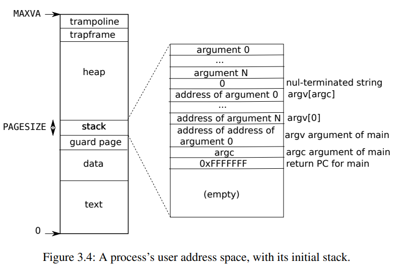
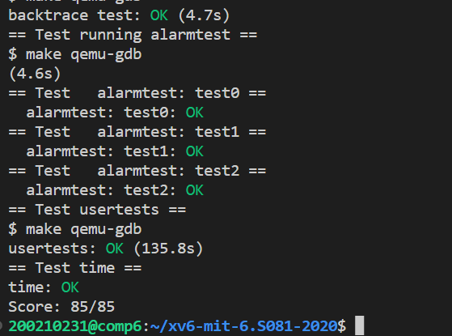

# Lab: traps

https://pdos.csail.mit.edu/6.828/2020/labs/traps.html

本实验室探索如何使用陷阱实现系统调用。您将首先使用堆栈进行热身练习，然后将实现用户级陷阱处理的示例。

难度：⭐⭐⭐⭐

## Task 1: RISC-V assembly
见 `anwsers-traps.txt`
## Task 2: Backtrace

打印`ra`（return address）。每当调用一次函数, callee会将caller的下条指令地址（即`ra`），caller的栈顶指针（`frame pointer`）及有关寄存器压入当前栈中。当有函数嵌套调用时，就会在用户stack中向下堆叠。本任务就是利用循环，向上遍历，打印出一层层调用的返回地址（`ra`）,直至到达用户栈顶。



```C
void
backtrace(void)
{
  printf("backtrace:\n");
  uint64 fp = r_fp();
  uint64 up_bound = PGROUNDUP(fp);
  while(fp < up_bound){
    printf("%p\n", *((uint64 *)(fp-8)));
    fp = *((uint64 *)(fp-16));
  }
}
```

## Task 2：Alarm   
本质上是让`kernel`完成一次（用户程序中的）函数调用。每当`interval`时间一到，就在当前程序处调用一次`handler function`（相当于平白无故插入一个handler函数）。但这个过程对用户程序是透明的，即`kernel`要完成以下工作:    
    1. 保存有关寄存器值   
    2. 将`pc`(即`p->trapframe->epc`)值指向`handler`   
    3. 执行完后，恢复有关寄存器值

### test0: invoke handler

和lab-syscall中的trace类似，在PCB中新增域   
    `interval`：时间间隔   
    `alarm_ticks_cnt` ：ticks 计数器(保存目前计数值)  
    `handler`：handler地址   
设置完毕后，CPU会在每个tick触发一次时钟中断，在`kernel/trap.c`中处理时钟中断的地方更新计数器，判断是否一个时钟间隔完成，若完成就将`epc`更改为handler的地址。

```C
  // give up the CPU if this is a timer interrupt.
  // Every tick, the hardware clock forces an interrupt
  if(which_dev == 2){
    if(p->interval !=0){
      p->alarm_ticks_cnt += 1;//cnt ticks
      if(p->alarm_ticks_cnt == p->interval){
        p->alarm_ticks_cnt = 0;                      //update counter
        
        if(p->trapframe_for_sigalarm == 0){
          p->trapframe_for_sigalarm = (struct trapframe *)kalloc();
          memmove(p->trapframe_for_sigalarm, p->trapframe, PGSIZE);//save epc and other registers
          p->trapframe->epc = p->handler;//set epc to point handler
        }
        else{
          yield();
        }
      }
      else{
        yield();
      }

    }
    else{
      p->alarm_ticks_cnt = 0;
      yield();
    }
  }
```

### test1/test2: resume interrupted code

test0中在转移到handler时，将用户程序后的pc值（即`epc`）(程序被”截胡“的那条指令)给覆盖了（这样当handler执行完成后就不知道从那条指令继续下去），同时也并未保护当前寄存器中的变量，因为在handler中可能会把这些值也给覆盖。为解决这个问题，不妨又用一个trapframe保存下来，当handler执行完毕再恢复（`sigreturn()`）。    
初始时，`trapframe_for_alarm==0`,当需要第二个trapframe保存时，使用`kalloc`分配新页,将trapframe拷贝过去。   
当恢复时（即handler程序结束），从trapframe恢复回来，使用`kfree`回收第二个trapframe，将其置零。   

通过判断`trapframe_for_alarm`是否为0，可以知道handler是否执行完毕，从而避免在handler处理过程中再次触发handler。（test2要求）

## Outcome


## 收获
1. 逻辑控制流要完整
2. 要细心